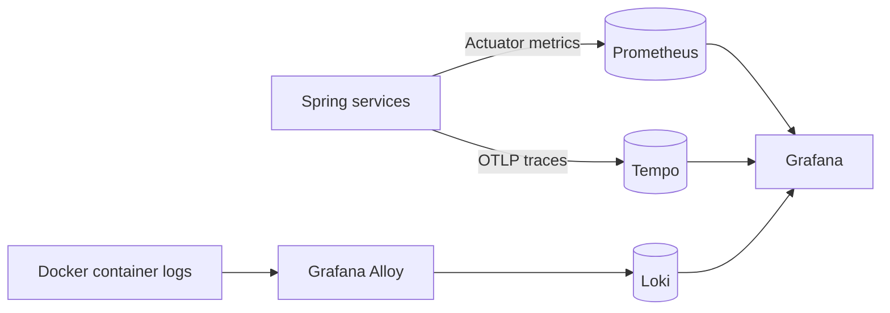

<div align="center">

# MarketHub v2

### A distributed marketplace platform built with Java and Spring

[](https://openjdk.org/)
[](https://spring.io/projects/spring-boot)
[](https://www.postgresql.org/)
[](https://kafka.apache.org/)
[](https://www.docker.com/)
[](https://github.com/tuiop1/MarketHub-v2/actions/workflows/testandbuild.yml)

**MarketHub v2** is a distributed marketplace platform that supports customer, merchant, and administrative workflows across independently deployable services. It provides secure authentication and role management, product and category management, cart operations, stock reservation, coordinated order and payment processing, failure compensation, asynchronous email notifications, observability, and automated deployment.

[Architecture](#architecture) · [API](#api-endpoints) · [Order Flow](#order-and-payment-flow) · [Run Locally](#running-locally) · [Deployment](#production-deployment)

</div>

---

## Project walkthrough

[](https://www.youtube.com/watch?v=Q2l-6236j-8)

---

## Overview

MarketHub supports the principal marketplace flows end to end:

- customers can register, browse products, manage a cart, and place orders;
- merchants can register, pass an approval workflow, and manage their products;
- administrators can manage merchant applications, customers, and categories;
- stock is reserved before payment and finalized only after a successful purchase;
- payment or downstream failures trigger refund/cancellation and stock-release compensation;
- registration and order-confirmation emails are processed asynchronously;
- metrics, logs, and traces can be inspected through an optional observability stack.

## Engineering highlights

- Eight Spring services organized around business and infrastructure responsibilities.
- Orchestrated purchase saga with explicit stock reservation and compensation.
- Keycloak-based OAuth 2.0/OpenID Connect authentication and role-based authorization.
- REST communication for immediate operations and Kafka events for asynchronous notifications.
- Separate logical database ownership for every stateful business service.
- Redis-backed gateway rate limiting and catalog caching.
- Eureka-based service discovery.
- Prometheus, Grafana, Loki, Tempo, Alloy, Micrometer, and OpenTelemetry integration.
- Docker Compose environments for local development and production deployment.
- GitHub Actions for testing, Compose validation, image builds, and VPS deployment.

---

## Architecture

MarketHub is divided into an edge layer, domain services, platform services, and supporting infrastructure. External requests enter through the reverse proxy and API Gateway. The gateway validates JWTs, applies Redis-backed rate limits, and forwards only public API routes. Keycloak owns identities and realm roles, while Eureka allows services to resolve each other without hard-coded addresses.

The business logic is split by capability rather than by technical layer. Account, catalog, cart, order, and payment data remain under the ownership of their respective services. They use separate logical PostgreSQL databases, although a single PostgreSQL container is used in the current Docker deployment to keep the infrastructure resource-efficient and operationally manageable.

Immediate operations use synchronous REST calls because the caller needs a result before continuing. Kafka is used for customer registration, merchant registration, and order-confirmation events because notification delivery should not extend or block the main transaction.

### Service boundaries

| Service | Port | Responsibility | State |
|---|---:|---|---|
| `gateway-service` | `8080` | API routing, JWT validation, and rate limiting | Redis |
| `account-service` | `8081` | Customer and merchant accounts, approval workflow, Keycloak administration | `account` database |
| `catalog-service` | `8082` | Categories, products, merchant catalog, and stock reservations | `catalog` database + Redis |
| `order-service` | `8083` | Orders, item snapshots, and purchase-saga orchestration | `orders` database |
| `cart-service` | `8084` | Customer carts and cart items | `cart` database |
| `payment-service` | `8085` | Payment lifecycle and refund/cancellation compensation | `payment` database |
| `notification-service` | `8086` | Kafka consumers and SendGrid email delivery | Stateless |
| `discovery-service` | `8761` | Eureka service registry | Stateless |

Application-service ports are internal to the Docker network. Payment, notification, discovery, and stock-reservation operations are intentionally not exposed as general public gateway routes.

---

## API endpoints

The external API is versioned under `/api/v1` and is accessed through the API Gateway. Protected endpoints expect a Keycloak bearer token:

```http
Authorization: Bearer <access-token>
```

### Main endpoint groups

| Area | Representative endpoints | Access |
|---|---|---|
| Registration | `POST /api/v1/auth/customers/register`<br>`POST /api/v1/auth/merchants/register` | Public |
| Public catalog | `GET /api/v1/products`<br>`GET /api/v1/products/{productId}`<br>`GET /api/v1/categories` | Public |
| Merchants | `GET /api/v1/merchants`<br>`GET /api/v1/merchants/{merchantId}`<br>`GET /api/v1/merchants/me` | Public / authenticated merchant |
| Customer account | `GET /api/v1/customers/me` | Customer |
| Cart | `GET /api/v1/carts`<br>`POST /api/v1/carts/items`<br>`DELETE /api/v1/carts/items/{itemId}`<br>`DELETE /api/v1/carts/items` | Authenticated customer |
| Orders | `POST /api/v1/orders/purchase`<br>`POST /api/v1/orders/my-cart/purchase`<br>`GET /api/v1/orders/me` | Customer |
| Merchant products | `GET /api/v1/merchant/products`<br>`POST /api/v1/merchant/products`<br>`PUT /api/v1/merchant/products/{productId}`<br>`DELETE /api/v1/merchant/products/{productId}` | Merchant |
| Administration | `/api/v1/admin/merchants/**`<br>`/api/v1/admin/customers/**`<br>`/api/v1/admin/categories/**` | Admin |

Collection endpoints support Spring pagination parameters where applicable:

```text
?page=0&size=20&sort=createdAt,desc
```

The table presents the main public contract rather than every controller method. Internal service endpoints are used only for service-to-service operations such as customer lookup, stock reservation, payment execution, and compensation.

---

## Order and payment flow

`order-service` acts as the saga orchestrator. It coordinates account, catalog, payment, and notification responsibilities without sharing their databases or attempting a distributed database transaction.

### Successful purchase

1. The authenticated customer submits a direct purchase request or purchases the current cart.
2. `order-service` loads the customer data required for the order snapshot.
3. `catalog-service` validates the requested products and creates a stock reservation.
4. The order is persisted with immutable product-name and price snapshots in `PENDING_PAYMENT` state.
5. `payment-service` creates and processes the payment.
6. When payment succeeds, the stock reservation is committed and the order becomes paid.
7. `OrderConfirmedEvent` is published to Kafka and consumed by `notification-service`, which sends the confirmation email independently of the HTTP request.

### Failure and compensation

A rejected payment releases the stock reservation and records the failed order state. If an unexpected error occurs after payment or stock work has already started, the orchestrator attempts the required compensating actions: payment cancellation or refund, followed by stock release. Compensation failure is stored explicitly instead of being hidden, making incomplete recovery visible for investigation.

This design keeps each service responsible for its own state while giving the purchase workflow a clear place for coordination and failure handling.

---

## Architectural approach

**Clear data ownership.** Each stateful domain service owns its schema and persistence logic. No service reads another service's tables directly, so integration happens through defined HTTP or event contracts.

**Consistency without distributed transactions.** The purchase flow uses reservation and compensation instead of a transaction spanning several databases. This increases workflow complexity, but it makes partial failures explicit and preserves service autonomy.

**Different communication styles for different requirements.** REST is used when the next step depends on an immediate response. Kafka is reserved for asynchronous side effects, primarily notification delivery, where temporary consumer unavailability should not invalidate the completed business operation.

**Security at more than one layer.** The gateway validates incoming tokens and downstream protected services also operate as OAuth 2.0 resource servers. Administrative identity operations are isolated in `account-service` through a confidential Keycloak service account.

**Production-oriented deployment with controlled infrastructure costs.** The deployment uses one VPS, one Kafka broker, and one PostgreSQL server to control cost and resource usage. Logical service separation, health checks, persistent volumes, observability, and automated deployment are retained while keeping the operational footprint manageable.

---

## Identity and authorization

- Keycloak provides OpenID Connect authentication and issues JWT access tokens.
- The gateway and protected services validate signed tokens as OAuth 2.0 resource servers.
- The frontend uses a public Keycloak client for interactive login.
- `account-service` uses a confidential service account to create users, assign roles, and manage account state.
- Merchant privileges are granted only after administrative approval.
- Platform roles include `ADMIN`, `CUSTOMER`, `MERCHANT_PENDING`, `MERCHANT`, and `MERCHANT_REJECTED`.
- Production secrets are supplied through environment variables and are not committed to the repository.

---

## Event-driven notifications

`common-events` contains shared Kafka contracts including:

- `CustomerRegisteredEvent`
- `MerchantRegisteredEvent`
- `OrderConfirmedEvent`
- `OrderConfirmedItemSnapshot`

Account and order services publish these events. `notification-service` consumes them in its own consumer group and sends email through SendGrid. Notification latency and availability therefore do not extend the primary user-facing transaction.

---

## Observability

The optional `observability` Compose profile provides metrics, centralized logs, and distributed traces.



| Signal | Pipeline |
|---|---|
| Metrics | Spring Boot Actuator → Prometheus → Grafana |
| Logs | Structured container logs → Alloy → Loki → Grafana |
| Traces | OpenTelemetry OTLP export → Tempo → Grafana |

Tracing is controlled through `OTLP_TRACING_ENABLED` and is disabled by default for the lighter local stack.

---

## Technology stack

**Backend:** Java 25, Spring Boot 4.1, Spring Cloud, Spring MVC, Spring Cloud Gateway, Spring Security, Spring Data JPA, Hibernate, Spring Kafka, Actuator, Micrometer, OpenTelemetry, Maven, MapStruct, Lombok.

**Data and infrastructure:** PostgreSQL 16, Liquibase, Redis, Apache Kafka in KRaft mode, Keycloak, Eureka, SendGrid, Docker Compose, Nginx, and Caddy.

**Observability and delivery:** Prometheus, Grafana, Loki, Tempo, Grafana Alloy, GitHub Actions, and SSH-based VPS deployment.

**Testing:** JUnit 5, Mockito, Spring Boot test support, Testcontainers, repository tests, and integration tests for stateful workflows.

---

## Repository structure

```text
MarketHub-v2/
├── .github/workflows/
│   ├── testandbuild.yml
│   └── deployproduction.yml
├── backend/
│   ├── libs/
│   │   ├── common-api/
│   │   └── common-events/
│   └── services/
│       ├── account-service/
│       ├── cart-service/
│       ├── catalog-service/
│       ├── discovery-service/
│       ├── gateway-service/
│       ├── notification-service/
│       ├── order-service/
│       └── payment-service/
├── docker/
│   ├── keycloak/
│   └── postgres/
├── frontend/
├── observability/
├── .env.prod.example
├── docker-compose.yml
└── docker-compose.prod.yml
```

`common-api` contains deliberately shared API contracts. `common-events` contains Kafka event contracts used across service boundaries.

---

## Running locally

### Prerequisites

- Docker with Docker Compose
- JDK 25
- Git

### Start the project

```bash
git clone https://github.com/tuiop1/MarketHub-v2.git
cd MarketHub-v2

export KEYCLOAK_ADMIN_CLIENT_SECRET="replace-with-a-long-random-local-secret"
docker compose up -d --build
```

Optional email configuration:

```bash
export SENDGRID_API_KEY="your-api-key"
export SENDGRID_FROM_EMAIL="verified-sender@example.com"
export SENDGRID_FROM_NAME="MarketHub"
```

Without valid SendGrid credentials, the platform can still run, but real email delivery is unavailable.

### Local URLs

| Component | URL |
|---|---|
| Application | `http://localhost:3000` |
| Keycloak | `http://localhost:8090` |
| Grafana with observability enabled | `http://localhost:3001` |

The local Keycloak bootstrap administrator is `admin` / `admin` and is intended only for development.

### Run backend verification

```bash
cd backend
./mvnw --batch-mode --no-transfer-progress clean verify
```

### Start the observability profile

```bash
export OTLP_TRACING_ENABLED=true
docker compose --profile observability up -d --build
```

### Inspect or stop the stack

```bash
docker compose ps
docker compose logs -f gateway-service order-service payment-service
docker compose down
```

Use `docker compose down -v` only when the persistent local data should also be deleted.

---

## CI/CD

The reusable `Test and build` workflow runs backend tests, validates the Compose configuration, and builds the production images. The production workflow is triggered manually from `main`, reuses CI as a validation gate, connects to the VPS through SSH, updates `/opt/MarketHub-v2` to `origin/main`, and recreates the Compose stack. It also preserves whether the observability profile was enabled before deployment.

Required GitHub Actions secrets:

- `VPS_HOST`
- `VPS_USER`
- `VPS_SSH_PRIVATE_KEY`

---

## Production deployment

Production is deployed with `docker-compose.prod.yml`. The VPS needs Docker, Docker Compose, Git, and publicly reachable ports `22`, `80`, and `443`. Caddy is the public entry point: it serves the frontend and reverse-proxies `/api/` to the gateway and `/auth/` to Keycloak. PostgreSQL, Kafka, Redis, Eureka, and the application services remain inside the Docker network.

### First deployment

```bash
sudo mkdir -p /opt
sudo git clone https://github.com/tuiop1/MarketHub-v2.git /opt/MarketHub-v2
cd /opt/MarketHub-v2

cp .env.prod.example .env.prod
nano .env.prod
```

At minimum, replace the example values for:

- `SERVER_IP`
- `ACME_EMAIL`
- `POSTGRES_PASSWORD`
- `KEYCLOAK_DB_PASSWORD`
- `KEYCLOAK_ADMIN_PASSWORD`
- `KEYCLOAK_ADMIN_CLIENT_SECRET`

Then start the platform:

```bash
docker compose \
  -f docker-compose.prod.yml \
  --env-file .env.prod \
  up -d --build
```

To include the observability stack:

```bash
docker compose \
  -f docker-compose.prod.yml \
  --env-file .env.prod \
  --profile observability \
  up -d --build
```

### Verify the deployment

```bash
docker compose -f docker-compose.prod.yml --env-file .env.prod ps
docker compose -f docker-compose.prod.yml --env-file .env.prod logs -f gateway-service frontend
```

### Manual update

```bash
git fetch origin main
git reset --hard origin/main

docker compose \
  -f docker-compose.prod.yml \
  --env-file .env.prod \
  up -d --build
```

The same update is automated by `.github/workflows/deployproduction.yml` after the initial VPS checkout, `.env.prod`, and SSH secrets have been configured.

---

## Frontend

The included Angular frontend was **AI-generated** and integrated as a functional web client for the platform. It provides access to the main customer, merchant, and administrative workflows and allows the complete system to be demonstrated end to end.

The Java backend implements the platform's service decomposition, domain workflows, data consistency mechanisms, security, messaging, testing, deployment, and observability.

---

## Author

Developed by **[tuiop1](https://github.com/tuiop1)**.
